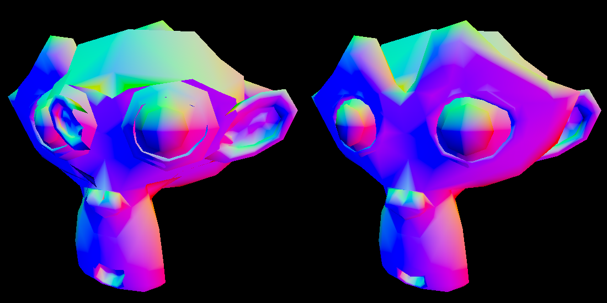

# Renderer features
* A very minimal and limited "abstraction". The main goal of the project was to learn vulkan rather than making a general renderer.
* OBJ loading using the fast_obj library
* Image loading using the stb_image library
* Imgui support, which is used for toggling different modes concerning the BSP tree and depth buffer

# BSP tree features
* Builds a BSP tree and splits the mesh until all leaves contains convex submeshes
* Numerically robust BSP building using concepts from the book "Real-Time Collision Detection" by Christer Ericson. The concepts used are tolerance comparisons, thick planes and sharing split edges.
* Heuristics for determining plane splits to decrease tree depth. Not perfect, but far better than random choices.
* BSP tree traversal on the CPU, which reorders the mesh's index buffer elements to render triangles in the desired order

# "Depth modes"
An Imgui window can be used to toggle wireframe rendering, but can also be used to toggle different modes for handling triangle depth. These modes are:
* BSP back-to-front: traverses the BSP tree in an inefficient but correct order
* BSP front-to-back: traverses the BSP tree in an interesting but incorrect order
* BSP front-to-back using the stencil buffer: traverses the BSP tree in an efficient and correct order but stencil masking the rendered pixels, making sure that no triangle can be rendered on top of another triangle
* Standard depth testing using the depth buffer: uses the non-BSP-split mesh to compare the BSP traversal to the standard method of depth comparison
* No depth mode at all: the triangles in the original mesh are incorrectly rendered as-is

# Small but noteworthy features
* Vulkan is set to automatically perform gamma correction with respect to the swapchain images and loaded textures
* Index buffers can be either dynamically written from the CPU (VK_MEMORY_PROPERTY_DEVICE_LOCAL_BIT | VK_MEMORY_PROPERTY_HOST_VISIBLE_BIT) or be static on the GPU (VK_MEMORY_PROPERTY_DEVICE_LOCAL_BIT)
* Frames in flight that are separated from the swapchain images

