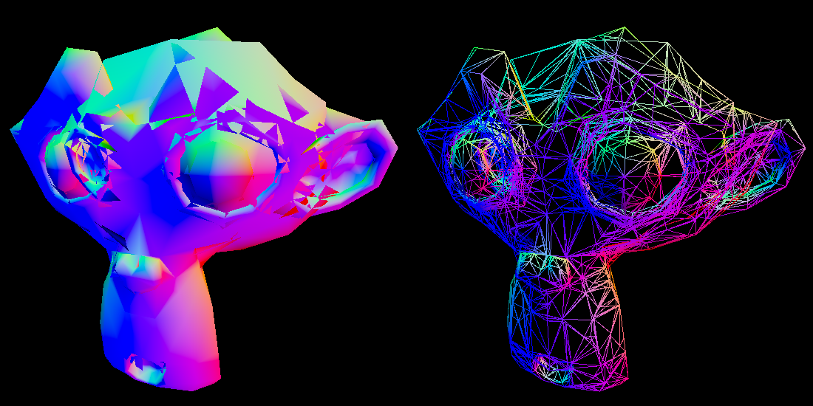

# Renderer features
* A very minimal and limited "abstraction". The main goal of the project was to learn vulkan rather than making a general renderer.
* OBJ loading using the fast_obj library
* Image loading using the stb_image library
* Imgui support, which is used for toggling different modes concerning the BSP tree and depth buffer

# BSP tree features
* Builds a BSP tree and splits the mesh until all leaves contains convex submeshes
* Numerically robust BSP building using concepts from the book "Real-Time Collision Detection" by Christer Ericson. The concepts used are tolerance comparisons, thick planes and sharing split edges.
* Heuristics for determining which triangle to create a splitting plane from, to avoid unnecessarily increasing the tree depth. Not perfect, but far better than random choices.
* BSP tree traversal on the CPU, which reorders the mesh's index buffer elements to render triangles in the desired order

# "Depth modes"
An Imgui window can be used to toggle wireframe rendering, but can also be used to toggle different modes for handling triangle depth. These modes are:
* BSP back-to-front: traverses the BSP tree in an inefficient but correct order
* BSP front-to-back: traverses the BSP tree in an interesting but incorrect order
* BSP front-to-back using the stencil buffer: traverses the BSP tree in an efficient and correct order but stencil masking the rendered pixels, making sure that no triangle can be rendered on top of another triangle
* Standard depth testing using the depth buffer: uses the non-BSP-split mesh to compare the BSP traversal to the standard method of depth comparison
* No depth mode at all: the triangles in the original mesh are incorrectly rendered as-is

# Performance
* CPU: i7-8700
* GPU: RTX 3080 Ti

All data was recorded when running in release mode.

Statistics about the BSP builds are shown next. The times were calculated using the average of three runs, since the time variation was incredibly low. The number of triangles and tree depth remains constant between each run.
| Model | Number of triangles before BSP building | Number of triangles after BSP building | Tree depth | BSP build time |
| :--- | :---:  | :---: | :---: | :---: |
| Suzanne | 968 | 12308 | 15 | 1.2 seconds |
| Stanford Dragon | 10600 | 95284 | 22 | 71 seconds |

Statistics about the depth modes in runtime are shown here. The delta times were calculated using the average between 100 000 frames. The window size was 1280 x 720 and the camera was placed so the whole model was in view. Different camera orientations were tested, but the effect on delta time was incredibly small. Take these numbers with a grain of salt.
| Model | BSP back-to-front | BSP front-to-back | BSP front-to-back using stencil buffer | Standard depth testing | No depth mode |
| :--- | :---: | :---: | :---: | :---: | :---: |
| Suzanne | 0.56 ms | 0.55 ms | 0.56 ms | 0.42 ms | 0.41 ms |
| Stanford Dragon | 2.11 ms | 2.08 ms | 2.08 ms | 0.42 ms | 0.42 ms |

# Small but noteworthy features
* Vulkan is set to automatically perform gamma correction with respect to the swapchain images and loaded textures
* Index buffers can be either dynamically written from the CPU (VK_MEMORY_PROPERTY_DEVICE_LOCAL_BIT | VK_MEMORY_PROPERTY_HOST_VISIBLE_BIT) or be static on the GPU (VK_MEMORY_PROPERTY_DEVICE_LOCAL_BIT)
* Frames in flight that are separated from the swapchain images

